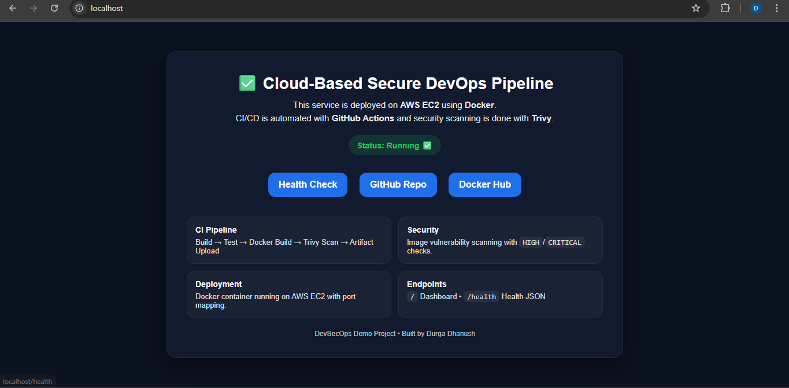
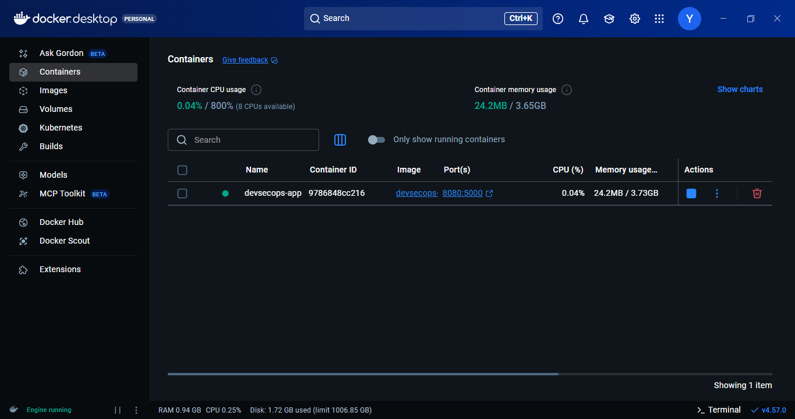
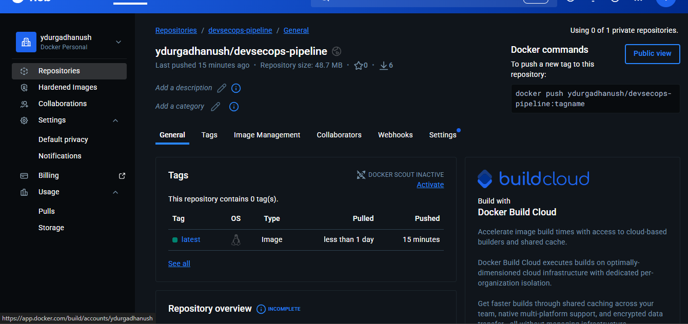
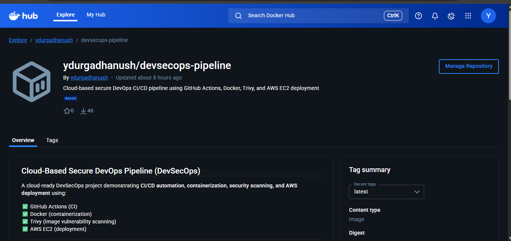
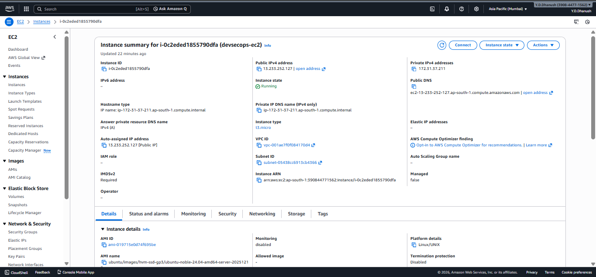
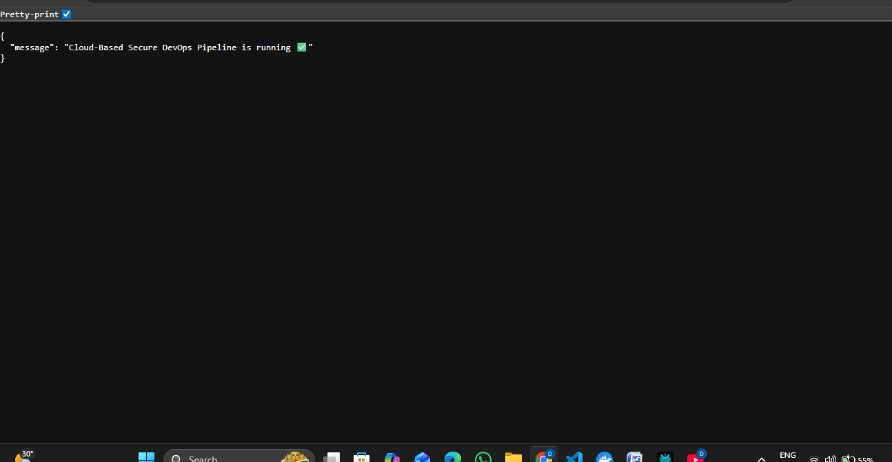
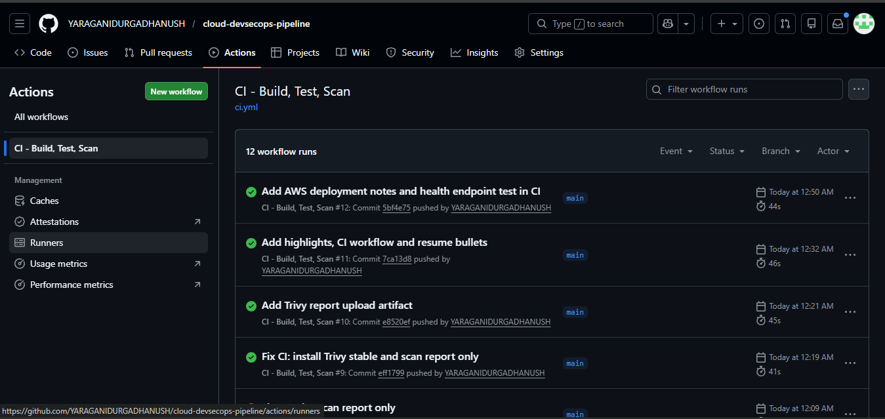
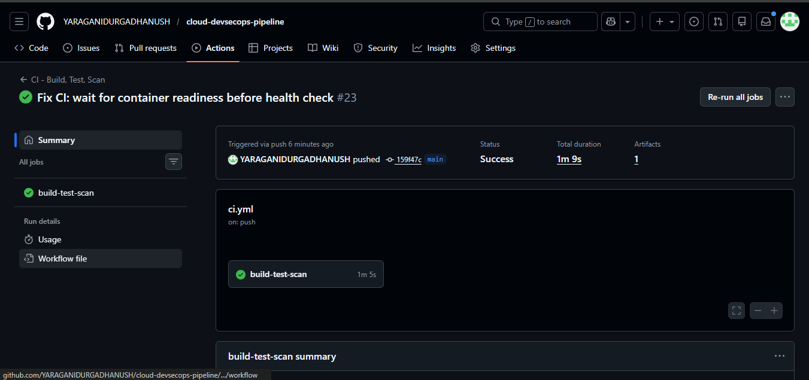

# Cloud-Based Secure DevOps Pipeline for Software Development

## Live Demo (AWS EC2)

⚠️ **Note:**  
The AWS EC2 instance used for this demo may not be running continuously to avoid cloud costs.

- 🌐 Application URL (when instance is running):  
  http://13.233.252.127/

- ❤️ Health Check Endpoint (when instance is running):  
  http://13.233.252.127/health

📸 Screenshots and CI/CD logs are provided below as **proof of successful deployment and execution**.
> This project demonstrates a complete DevSecOps workflow.  
> Infrastructure is provisioned temporarily for demonstration purposes.

## Docker Hub Image
✅ https://hub.docker.com/r/ydurgadhanush/devsecops-pipeline

## Architecture Diagram


## Project Highlights
- ✅ CI/CD automation using GitHub Actions
- ✅ Dockerized Python (Flask) application for consistent deployments
- ✅ Security scanning using Trivy (HIGH/CRITICAL)
- ✅ Trivy JSON report generated and uploaded as an artifact
- ✅ Job Summary prints vulnerability counts and fails build on CRITICAL issues

## Screenshots

### Application & Health Check


### Docker


### Docker Hub



### AWS EC2



### GitHub Actions (CI/CD)



## CI Workflow (GitHub Actions)
On every push/PR to `main`, the pipeline:
1. Installs dependencies
2. Runs a basic Flask import test
3. Builds the Docker image
4. Runs container and tests `/health` endpoint
5. Scans the image using Trivy (HIGH/CRITICAL)
6. Uploads Trivy report as an artifact

## Resume Bullet Points
- Deployed a Dockerized Flask application on AWS EC2 and exposed it via a public HTTP endpoint.
- Built a CI pipeline using GitHub Actions to automate Docker builds, health checks, and Trivy vulnerability scanning.
- Published Docker images to Docker Hub for versioned container delivery and simplified cloud deployments.

## Tech Stack
- Python (Flask)
- Docker
- Git & GitHub
- GitHub Actions (CI)
- Trivy (Image vulnerability scanning)
- AWS EC2 (Deployment)

## Pipeline Flow
1. Code push / PR triggers GitHub Actions
2. Dependencies are installed
3. Basic test runs
4. Docker image is built
5. Container health check is tested
6. Trivy scan checks HIGH/CRITICAL vulnerabilities
7. Report is uploaded as an artifact

## Run Locally
```bash
docker build -t devsecops-pipeline .
docker run -p 5000:5000 devsecops-pipeline
