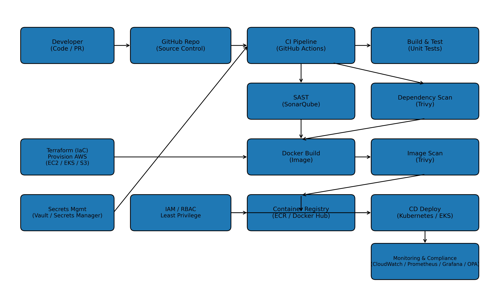

# Cloud-Based Secure DevOps Pipeline for Software Development

## Architecture Diagram


This project demonstrates a secure CI/CD pipeline using GitHub Actions, Docker, and vulnerability scanning.

## Tech Stack
- Python (Flask)
- Docker
- Git & GitHub
- GitHub Actions (CI)
- Trivy (Image vulnerability scanning)

## Pipeline Flow
1. Code push / PR triggers GitHub Actions
2. Dependencies are installed
3. Basic test runs
4. Docker image is built
5. Trivy scan checks HIGH/CRITICAL vulnerabilities

## Run Locally
```bash
docker build -t devsecops-pipeline .
docker run -p 5000:5000 devsecops-pipeline
